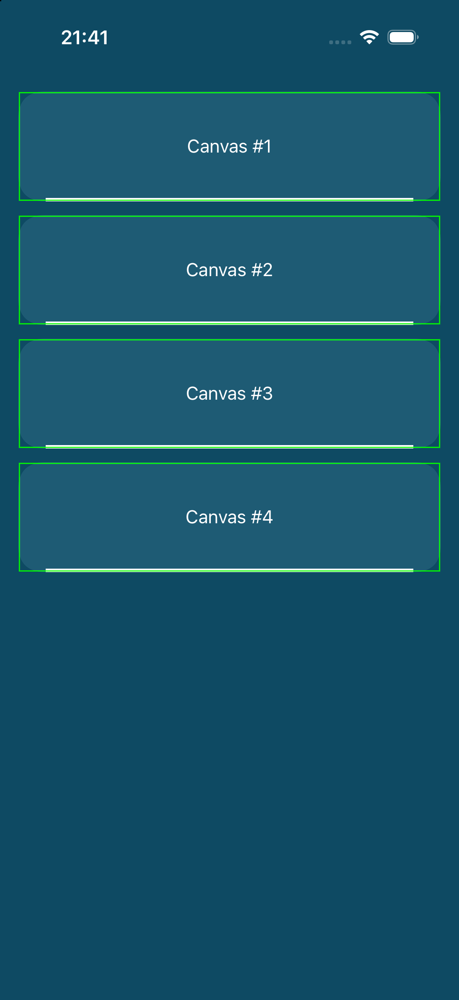

# react-native-skia — first two Canvas instances render displaced/clipped at the bottom

Minimal reproduction for a rendering bug on **iOS + new architecture (Fabric)**:
when several `<Canvas>` components mount inside the same subtree, the **first
two instances in tree order** render (some of) their paths vertically
displaced/scaled downward by roughly **5% of the canvas height**, getting
clipped at the canvas bounds. Every Canvas mounted after them renders
correctly — and a reference path drawn in the *same* affected canvas can
render correctly too.

## Environment

- `expo` 57.0.4 · `react-native` 0.86.0 (new arch) · `@shopify/react-native-skia` 2.6.2 · `react-native-reanimated` 4.5.0
- Also reproduced with skia **2.6.9** in a real app, on simulator and device (iOS 26)

## Run

```sh
bun install   # or npm/yarn/pnpm
npx expo run:ios --configuration Release
```

(Debug builds show it too; Release just avoids needing Metro.)

## What you should see

Four identical cards. Each draws, in one Canvas: a rounded fill reaching the
canvas bottom, a 3px white stroke at `y = H - 1.5`, and a 1px lime reference
rect inset 1px from the canvas bounds.

**Expected**: 4 identical renders.
**Actual**: on cards **#1 and #2** the fill's bottom corners overflow (they
look square) and the white stroke lands at `y ≈ H`, overlapping the lime
line — everything pushed down ~5%. Cards #3 and #4 are pixel-perfect. The
lime reference rect is correct on all four.



## Notes

- Deterministic and permanent: survives reloads, scrolling, remounting with a
  new `key`, and deferring the Canvas mount by 1.6s.
- Follows **tree order**, not screen position: reordering the cards moves the
  bug to whichever two mount first.
- Same result passing paths as `SkPath` objects or SVG strings.
- Workaround used in production: extend the Canvas past the bottom of its
  wrapper (`bottom: -Math.max(8, H * 0.08)`) so the displaced/clipped band
  falls in an empty transparent overhang.
